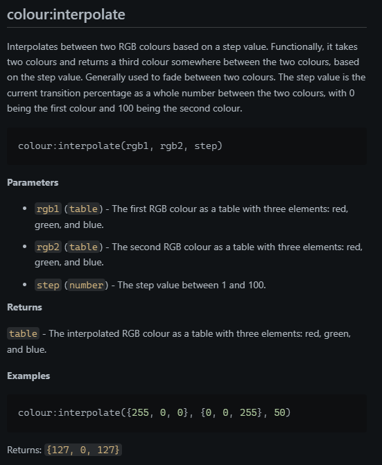

# gludoc

Gludoc is a VSCode extension for generating Lua documentation from Lua source
code.



## Features

Gludoc will trawl through your workspace and generate documentation for all
Lua files it can find.

It parses Lua Language Server documentation comments and uses these to generate
markdown documentation.

## Supported Tags

Gludoc supports the following tags:

### Single-line tags

#### Param

```lua
--- @param <type> <name> - <description>
```

#### Return

```lua
--- @return <type> - <description>
```

### Multi-line tags

#### Example

```lua
--- @example
--- <example>
--- <more example
--- <even more example
```

### Description

Anything that doesn't match a supported tag is treated as a description.

Describe specific features of your extension including screenshots of your extension in action. Image paths are relative to this README file.

## Release Notes

### 0.1.0

Initial release of Gludoc.

### 0.1.1

Fixed issue with function descriptions not being generated.

---


[Fromat icons created by PixelX - Flaticon](https://www.flaticon.com/free-icons/fromat)[^1]

[^1]: This is not a typo by me, this is the attribution required by Flaticon for the format icons used in the extension.
